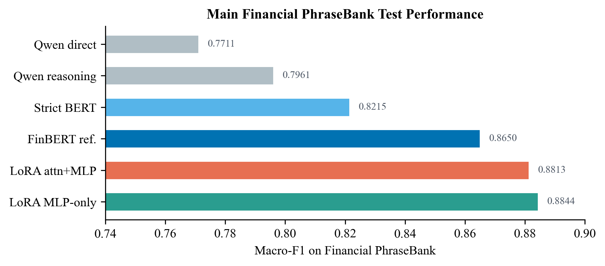
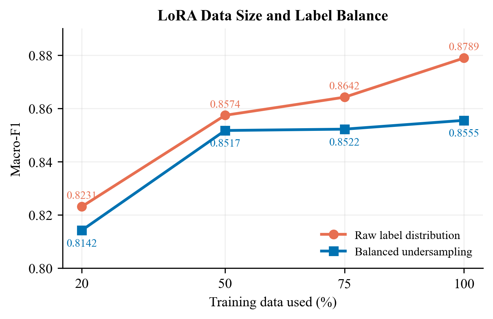
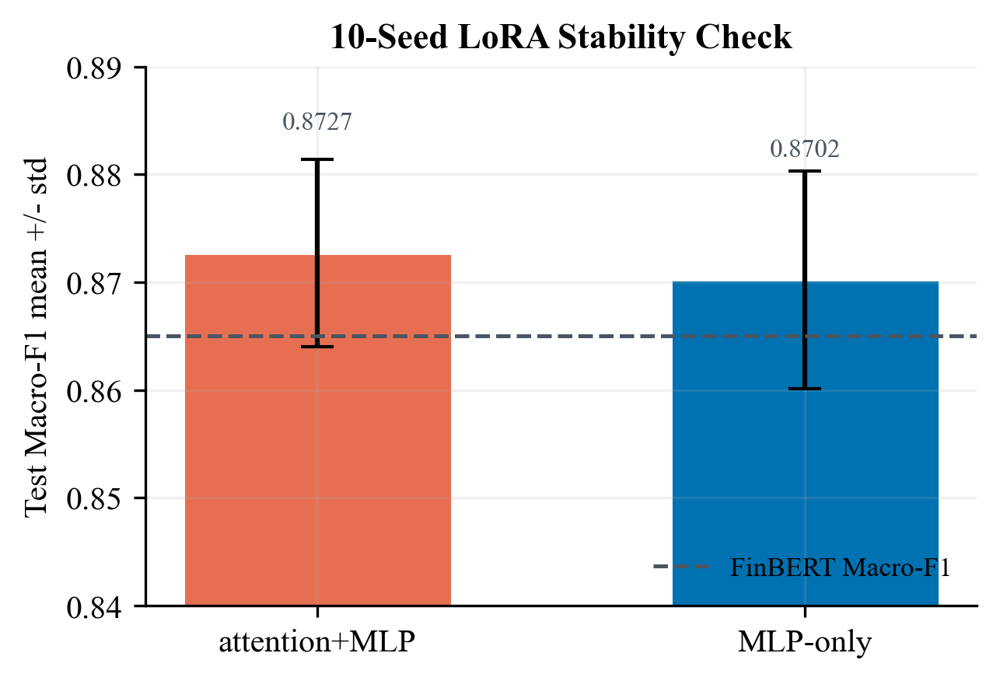
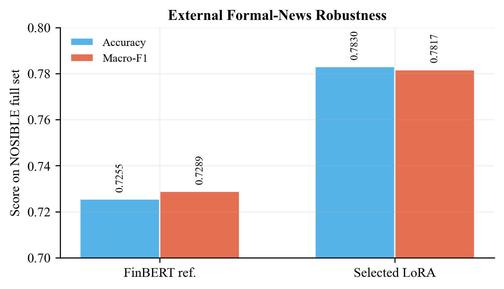
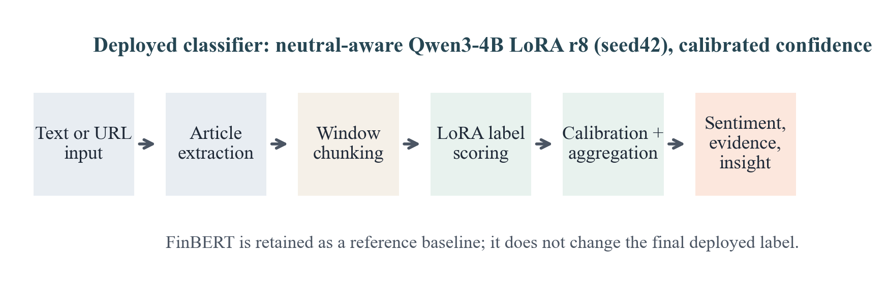

# Financial Sentiment Analysis and Investment Decision Support with LoRA-Tuned Open-Weight LLMs

## Abstract

Financial sentiment analysis differs from general sentiment analysis because labels are defined by likely investor impact rather than surface tone alone. This study evaluates whether LoRA fine-tuning can align an open-weight LLM with investor-perspective financial sentiment labels. Using Financial PhraseBank as the main dataset, the project compares FinBERT, a strict supervised BERT baseline, zero-shot Qwen3-4B prompting, simple reasoning prompting, and Qwen3-4B LoRA fine-tuning. It further examines data-size effects, label-balance effects, LoRA rank/module choices, calibration, statistical significance, higher-agreement robustness, model behavior, and external formal-news robustness on `NOSIBLE/financial-sentiment`. Results show that neutral-aware Qwen3-4B LoRA improves clearly over prompt-only LLM baselines, slightly outperforms FinBERT on the Financial PhraseBank test split, and transfers substantially better than FinBERT to a 100,000-example formal-news external dataset. The final system uses the neutral-aware LoRA model as the deployed classifier and keeps FinBERT as a reference baseline.

## 1. Introduction

Financial news sentiment classification is not the same as ordinary positive or negative language detection. A corporate event may sound positive but still be neutral if it has no clear financial implication. Conversely, factual statements about losses, downgrades, regulatory risk, or weak guidance can be negative even without emotional wording.

This project studies whether an open-weight LLM can be adapted to this investor-impact label definition through lightweight fine-tuning. The study is not positioned as a new model architecture. Its contribution is a controlled empirical evaluation and a working prototype: what improves performance, what fails to generalize, and which model should be deployed for formal financial-news analysis.

The main contributions are:

1. A controlled comparison of Qwen3-4B direct prompting, reasoning prompting, supervised BERT, FinBERT, and Qwen3-4B LoRA on Financial PhraseBank.
2. A data-condition study of LoRA under 20%, 50%, 75%, and 100% training data, with raw versus balanced label distributions.
3. LoRA design checks covering rank, target modules, dropout, learning rate, and 10-seed stability, leading to a neutral-aware rank-8 attention+MLP adapter.
4. Robustness analysis on higher-agreement Financial PhraseBank subsets and a full 100,000-example NOSIBLE formal-news external set.
5. Confidence reliability analysis using ECE, Brier score, NLL, and validation-set temperature scaling, separating classification accuracy from probability reliability.
6. Model-understanding analysis covering neutral-boundary errors, probability shifts, counterfactual probes, and hidden-state separability.
7. A Streamlit decision-support prototype for text and URL-based financial news analysis.

## 2. Related Work

Financial PhraseBank is a standard benchmark for investor-perspective financial sentiment analysis. Malo et al. introduced the dataset to study semantic orientation in economic text, using positive, neutral, and negative labels from an investor perspective.

FinBERT adapts pre-trained language models to financial text. `ProsusAI/finbert` is useful as a strong practical reference, but it should not be treated as a leakage-free supervised baseline here because the checkpoint was fine-tuned on Financial PhraseBank. This project therefore also includes a strict supervised BERT baseline trained only on the current split.

Recent financial LLM work, including BloombergGPT, FinGPT, PIXIU/FLARE, and instruction-tuned financial LLMs, shows that large language models can support financial NLP tasks but still require task alignment and careful evaluation. LoRA is appropriate for this project because it adapts Qwen3-4B with a small number of trainable parameters, making local training feasible on a consumer GPU.

Confidence calibration is relevant because maximum softmax probability is not the same as true correctness probability. This project uses confidence as a model score and analyzes calibration with ECE, Brier score, and temperature scaling.

## 3. Dataset And Task

The main dataset is Financial PhraseBank `sentences_50agree`. The task is three-class classification:

```text
negative
neutral
positive
```

The fixed split is stratified at 70/15/15:

| Split | Examples |
|---|---:|
| Train | 3,392 |
| Validation | 727 |
| Test | 727 |

The full `sentences_50agree` label distribution is neutral-heavy:

| Label | Count |
|---|---:|
| Negative | 604 |
| Neutral | 2,879 |
| Positive | 1,363 |

To address data-size and label-balance sensitivity, LoRA is trained with 20%, 50%, 75%, and 100% of the training split under both the original raw distribution and balanced undersampling.

External formal-news robustness is evaluated on `NOSIBLE/financial-sentiment`. The full 100,000-example train split is used only as an evaluation set. No model is trained or selected on NOSIBLE. The dataset contains 24,434 negative, 39,309 neutral, and 36,257 positive examples. The mean text length is 92.6 words, and major sources include Yahoo Finance, PR Newswire, Benzinga, BusinessWire, CNBC, and Nasdaq.

## 4. Method

### 4.1 Baselines

| Model | Role |
|---|---|
| `ProsusAI/finbert` | Off-the-shelf financial-domain reference model |
| `bert-base-uncased` | Strict supervised baseline trained only on the current split |
| `Qwen/Qwen3-4B` direct prompt | Zero-shot open-weight LLM baseline |
| `Qwen/Qwen3-4B` reasoning prompt | Tests whether simple investor-impact reasoning helps |
| `Qwen/Qwen3-4B` LoRA | Main adapted open-weight LLM |

### 4.2 LLM Label Scoring

The LLM is implemented as a label scorer rather than a free-form generator. Given text \(x\), the prompt asks for one of the three sentiment labels. The next-token logits for the candidate labels are normalized with softmax:

\[
p_L(y \mid x)=\frac{\exp(z_y)}{\sum_k \exp(z_k)}
\]

The predicted label is:

\[
\hat{y}=\arg\max_y p_L(y \mid x)
\]

Confidence is:

\[
\mathrm{confidence}(x)=\max_y p_L(y \mid x)
\]

This produces reproducible raw probabilities for evaluation. For the deployed LoRA classifier, the displayed probabilities are then temperature-scaled using a validation-set temperature.

### 4.3 LoRA Fine-Tuning

The base LLM is Qwen3-4B. LoRA freezes the original model and trains low-rank updates:

\[
W' = W + \Delta W,\quad \Delta W = \frac{\alpha}{r}BA
\]

The final adapter is:

| Item | Setting |
|---|---|
| Base model | `Qwen/Qwen3-4B` |
| Adapter | `adapters/neutral_aware_lora_r8_full_raw_seed42` |
| Rank | 8 |
| Alpha | 16 |
| Dropout | 0.05 |
| Target modules | attention and MLP projections |
| Epochs | 3 |
| Learning rate | `1e-4` |
| Max sequence length | 384 |
| Prompt mode | neutral-aware |

The training objective is causal language modeling over the label token. The prompt tokens are masked, so the loss is applied only to the target label.

### 4.4 Neutral-Aware Prompt

Error analysis showed that many mistakes occur at the neutral boundary. The neutral-aware prompt therefore instructs the model to use positive or negative only when the text implies a clear beneficial or harmful investor impact. Factual corporate events without clear financial implication should be neutral.

## 5. Experimental Setup

Experiments report accuracy, macro-F1, weighted-F1, per-class precision and recall, and confusion matrices. Macro-F1 is emphasized because the main dataset is class-imbalanced. Additional checks include ECE, Brier score, temperature scaling, multi-seed stability, paired bootstrap, McNemar testing, higher-agreement Financial PhraseBank subsets, NOSIBLE external robustness, error taxonomy, counterfactual probes, and hidden-state separability.

The validation split is used for model-selection decisions such as prompt/training configuration and calibration analysis. The test split is reserved for final Financial PhraseBank reporting. NOSIBLE is used only as an external evaluation set.

The results distinguish between single-seed model screening, multi-seed confirmation, and external evaluation. The single-seed Financial PhraseBank table reports concrete seed42 checkpoints, including the two strongest LoRA variants. The 10-seed table then checks whether the selected design is robust to random initialization and data-order effects. The external table evaluates only the final selected model against FinBERT.

## 6. Results

### 6.1 Baseline Comparison

Financial PhraseBank `sentences_50agree`, fixed test split:

| Method | Accuracy | Macro-F1 | Weighted-F1 |
|---|---:|---:|---:|
| Qwen3-4B direct prompt | 0.7950 | 0.7711 | 0.7858 |
| Qwen3-4B reasoning prompt | 0.8019 | 0.7961 | 0.7996 |
| Strict BERT supervised | 0.8418 | 0.8215 | 0.8406 |
| FinBERT reference | 0.8776 | 0.8650 | 0.8792 |

Prompt-only Qwen3-4B is below FinBERT and the strict supervised baseline. This motivates LoRA fine-tuning rather than using the open-weight LLM only through prompting.



### 6.2 LoRA Data Size And Label Balance

This experiment uses the initial Qwen3-4B LoRA setting with rank 16 and attention+MLP target modules. It is placed before the architecture ablation because its purpose is to decide the training-data condition for later LoRA experiments: how much training data to use and whether to preserve the original label distribution or use balanced undersampling.

| Condition | Accuracy | Macro-F1 | Weighted-F1 |
|---|---:|---:|---:|
| LoRA 20% balanced | 0.8074 | 0.8142 | 0.8088 |
| LoRA 20% raw | 0.8308 | 0.8231 | 0.8264 |
| LoRA 50% raw | 0.8624 | 0.8574 | 0.8616 |
| LoRA 50% balanced | 0.8501 | 0.8517 | 0.8507 |
| LoRA 75% raw | 0.8707 | 0.8642 | 0.8665 |
| LoRA 75% balanced | 0.8583 | 0.8522 | 0.8581 |
| LoRA 100% raw | 0.8803 | 0.8789 | 0.8813 |
| LoRA 100% balanced | 0.8624 | 0.8555 | 0.8635 |

The raw training distribution improves consistently as data size increases. Balanced undersampling helps some minority behavior but reduces stability on the naturally neutral-heavy test distribution. Therefore, the later LoRA screening uses the full raw Financial PhraseBank training split.



### 6.3 LoRA Model Screening

After fixing the data condition to the full raw training split, the next stage screens LoRA design choices. The grid changes rank, target modules, dropout, learning rate, and neutral-aware training. This is a single-seed screening stage, so it is used to identify strong candidates rather than to make the final selection.

| Model setting | Validation Macro-F1 | Test Accuracy | Test Macro-F1 |
|---|---:|---:|---:|
| Qwen3-4B LoRA 100% raw r16 attention+MLP | 0.8695 | 0.8803 | 0.8789 |
| r4 attention+MLP, dropout 0.05, lr 1e-4 | 0.8674 | 0.8858 | 0.8792 |
| Neutral-aware LoRA r8 attention+MLP, dropout 0.05, lr 1e-4 (seed42) | 0.8783 | 0.8858 | 0.8813 |
| r16 attention+MLP, dropout 0.05, lr 1e-4 | 0.8755 | 0.8721 | 0.8723 |
| r8 attention-only, dropout 0.05, lr 1e-4 | 0.8641 | 0.8817 | 0.8741 |
| Neutral-aware LoRA r8 MLP-only, dropout 0.05, lr 1e-4 (seed42) | 0.8758 | 0.8900 | 0.8844 |
| attention+MLP LoRA r8, dropout 0.10, lr 1e-4 | 0.8804 | 0.8831 | 0.8814 |
| attention+MLP LoRA r8, dropout 0.05, lr 2e-4 | 0.8848 | 0.8858 | 0.8792 |

The strongest single-seed test result comes from MLP-only LoRA, while attention+MLP has a slightly higher validation Macro-F1. The two settings are therefore carried forward to the multi-seed confirmation stage.

Neutral-aware training is included in this screening stage because error analysis showed many mistakes at the neutral boundary. It reduces false directional predictions from neutral examples and is retained in both final candidates.

| Method | Test Accuracy | Test Macro-F1 | Test Weighted-F1 | Errors | Neutral false direction | Missed directional |
|---|---:|---:|---:|---:|---:|---:|
| LoRA r8 original | 0.8831 | 0.8813 | 0.8828 | 85 | 41 | 44 |
| LoRA r8 neutral-aware trained (seed42) | 0.8858 | 0.8813 | 0.8848 | 83 | 33 | 50 |

### 6.4 10-Seed Final Selection

The final in-domain selection compares the two strongest LoRA settings from Section 6.3 across ten random seeds. This step is necessary because a single seed can give an unstable impression of which target-module choice is better.

| Model variant | Seeds | Val Macro-F1 Mean | Val Macro-F1 Std | Test Macro-F1 Mean | Test Macro-F1 Std | Test Accuracy Mean |
|---|---:|---:|---:|---:|---:|---:|
| LoRA r8 attention+MLP | 10 | 0.8667 | 0.0081 | 0.8727 | 0.0087 | 0.8770 |
| LoRA r8 MLP-only | 10 | 0.8658 | 0.0072 | 0.8702 | 0.0101 | 0.8761 |

After the 10-seed check, the attention+MLP adapter is slightly stronger on mean Financial PhraseBank test macro-F1 and has a slightly lower test standard deviation. Therefore the final choice is `neutral_aware_lora_r8_full_raw_seed42`. The conclusion is deliberately modest: the advantage over MLP-only LoRA is small, but the final adapter is supported by the in-domain seed stability check.



### 6.5 Agreement Robustness

| Subset | FinBERT Macro-F1 | LoRA r8 (seed42) Macro-F1 |
|---|---:|---:|
| 50agree test | 0.8650 | 0.8813 |
| 66agree test | 0.8936 | 0.9214 |
| 75agree test | 0.9217 | 0.9634 |
| allagree test | 0.9388 | 0.9911 |

Scores increase as annotation agreement becomes stricter, which is expected because high-agreement samples are less ambiguous. LoRA benefits strongly on the clearest examples.

### 6.6 External Formal-News Robustness

After the 10-seed comparison, the selected attention+MLP LoRA model is evaluated on the full `NOSIBLE/financial-sentiment` external set. This checks whether the final in-domain choice transfers to a larger formal-news dataset.

| Method | Accuracy | Macro-F1 | Weighted-F1 |
|---|---:|---:|---:|
| FinBERT reference | 0.7255 | 0.7289 | 0.7259 |
| Selected LoRA r8 attention+MLP (seed42) | 0.7830 | 0.7817 | 0.7827 |

Paired comparison supports the difference: LoRA corrects 16,244 examples that FinBERT gets wrong while losing 10,495 examples that FinBERT gets right. The accuracy gain is 0.0575 and the macro-F1 gain is 0.0528.



Length-bin analysis shows a remaining limitation. LoRA is strongest on short and medium formal-news snippets, with macro-F1 0.8280 for texts with 50 words or fewer and 0.7952 for 51-150 words. It drops to 0.5796 for 151-300 word inputs, which supports the need for window-based long-article processing.

### 6.7 Confidence Reliability

Confidence is defined as the maximum softmax probability of the predicted class. Because neural models can be overconfident, I evaluate probability reliability with negative log-likelihood (NLL), Brier score, expected calibration error (ECE), and validation-set temperature scaling. Temperature scaling changes only the probability sharpness; it does not change the predicted class, accuracy, or macro-F1.

For the selected r8 attention+MLP LoRA setting, the learned temperature is 1.365. This indicates that the raw LoRA probabilities are too sharp and should be softened for better calibration. On the Financial PhraseBank test split, temperature scaling reduces LoRA ECE from 0.0412 to 0.0151, Brier score from 0.1673 to 0.1618, and NLL from 0.2825 to 0.2696.

| Model | Split | Condition | Accuracy | Macro-F1 | NLL | Brier | ECE |
|---|---|---|---:|---:|---:|---:|---:|
| FinBERT | test | uncalibrated | 0.8776 | 0.8650 | 0.3400 | 0.1888 | 0.0189 |
| FinBERT | test | temperature-scaled | 0.8776 | 0.8650 | 0.3394 | 0.1891 | 0.0179 |
| LoRA r8 attention+MLP | test | uncalibrated | 0.8831 | 0.8813 | 0.2825 | 0.1673 | 0.0412 |
| LoRA r8 attention+MLP | test | temperature-scaled | 0.8831 | 0.8813 | 0.2696 | 0.1618 | 0.0151 |

In the current system, the displayed confidence score uses the temperature-scaled LoRA probability rather than the raw softmax confidence. The same calibrated probabilities are used for evidence scoring and long-article chunk aggregation. This makes the calibration analysis part of the deployed system, while the predicted label remains unchanged because temperature scaling preserves the probability ranking.

This should be interpreted as a reliability contribution rather than a classification-performance contribution. LoRA fine-tuning improves the sentiment classifier; temperature scaling makes the reported confidence less overconfident and therefore more suitable for uncertainty-aware decision support.

### 6.8 Evaluation Coverage

| Evaluation Aspect | Implementation |
|---|---|
| Standard metrics | Accuracy, macro-F1, weighted-F1, per-class reports, confusion matrices |
| Financial-domain reference | ProsusAI FinBERT |
| Leakage-aware supervised baseline | BERT-base trained only on the current split |
| Open-weight LLM baseline | Qwen3-4B direct and reasoning prompts |
| Lightweight LLM adaptation | Qwen3-4B LoRA |
| Data-size analysis | 20%, 50%, 75%, and 100% training subsets |
| Label-balance analysis | Raw distribution versus balanced undersampling |
| LoRA ablation | Rank, target-module, dropout, learning-rate, and seed comparisons |
| Confidence reliability | ECE, Brier score, and temperature scaling |
| Statistical testing | McNemar test and paired bootstrap confidence intervals |
| In-domain robustness | Higher-agreement Financial PhraseBank subsets |
| External robustness | Full NOSIBLE formal-news evaluation |
| Model understanding | Error taxonomy, probability shifts, counterfactual probes, hidden-state separability |

## 7. Model Understanding

The main remaining errors are neutral-boundary errors rather than simple positive-versus-negative polarity flips. This means the model usually understands basic polarity, but still struggles to decide whether a factual financial event should be considered investor-directional under the dataset definition.

Probability-shift analysis shows that LoRA increases the mean true-label probability compared with zero-shot Qwen3-4B, especially on positive examples. Neutral-aware training reduces false directional predictions on neutral cases.

The hidden-state analysis gives representation-level evidence. On a balanced subset of 90 PhraseBank test examples, a linear probe over the final hidden state improves from macro-F1 0.7739 for base Qwen3-4B to 0.8768 with the neutral-aware LoRA adapter. The silhouette score also improves from 0.2936 to 0.3596. These results suggest that LoRA changes the internal representation geometry so that financial sentiment labels become more linearly separable.

## 8. System Implementation

The final prototype is a Streamlit application that accepts pasted financial text or a news URL. The deployed classifier is neutral-aware Qwen3-4B LoRA. FinBERT is shown as a reference baseline, but it does not change the final sentiment label.

For long articles, the system extracts readable article text, splits it into overlapping windows, classifies each window with LoRA, temperature-scales the LoRA probabilities, aggregates calibrated probabilities at the document level, and displays key supporting excerpts. It also checks whether different window sizes produce different document labels. If they do, the result is marked as sensitive.



The investment-support insight is generated by Qwen3-4B using the final sentiment, probabilities, and evidence excerpts. The LoRA adapter is disabled during this generation step so that the base model's general language-generation ability is used. The prompt explicitly forbids buy, sell, hold, trading, and price-target instructions.

## 9. Discussion

The experiments support three main conclusions. First, direct prompting and simple reasoning prompting are not sufficient for investor-perspective financial sentiment analysis. Second, LoRA fine-tuning is effective and data-sensitive: using the full raw Financial PhraseBank training distribution is more stable than balanced undersampling. Third, the neutral-aware LoRA adapter transfers better than FinBERT to a large formal-news external dataset.

## 10. Limitations

Financial PhraseBank is small and sentence-level, while real financial articles are longer and more complex. `ProsusAI/finbert` is useful as a reference model but is not leakage-free with respect to Financial PhraseBank. The LoRA classifier is trained with a maximum sequence length of 384, so long-article support relies on window aggregation rather than document-level supervised training. Confidence uses validation temperature scaling, but it should still be interpreted as model uncertainty rather than a guaranteed probability of correctness. The hidden-state analysis is diagnostic evidence, not full mechanistic interpretability.

## 11. Conclusion

This study shows that LoRA fine-tuning can adapt an open-weight LLM to investor-perspective financial sentiment analysis. Neutral-aware Qwen3-4B LoRA improves over prompt-only Qwen3-4B, outperforms a strict supervised BERT baseline on Financial PhraseBank, and transfers better than FinBERT to the full NOSIBLE formal-news external set. The final prototype packages this LoRA-based classifier into a text and URL-based decision-support system that returns sentiment, confidence, supporting excerpts, and investment-support insight.

## References

Araci, D. (2019). FinBERT: Financial Sentiment Analysis with Pre-trained Language Models.

Devlin, J., Chang, M.-W., Lee, K., & Toutanova, K. (2019). BERT: Pre-training of Deep Bidirectional Transformers for Language Understanding.

Dettmers, T., Pagnoni, A., Holtzman, A., & Zettlemoyer, L. (2023). QLoRA: Efficient Finetuning of Quantized LLMs.

Guo, C., Pleiss, G., Sun, Y., & Weinberger, K. Q. (2017). On Calibration of Modern Neural Networks. ICML.

Hu, E. J., Shen, Y., Wallis, P., Allen-Zhu, Z., Li, Y., Wang, S., Wang, L., & Chen, W. (2021). LoRA: Low-Rank Adaptation of Large Language Models.

Malo, P., Sinha, A., Korhonen, P., Wallenius, J., & Takala, P. (2014). Good Debt or Bad Debt: Detecting Semantic Orientations in Economic Texts. Journal of the Association for Information Science and Technology.

NOSIBLE. Financial Sentiment Dataset. Hugging Face Datasets.

Qwen Team. (2025). Qwen3 Technical Report.

Vamvourellis, D., & Mehta, D. (2025). Reasoning or Overthinking: Evaluating Large Language Models on Financial Sentiment Analysis.

Wei, J., Wang, X., Schuurmans, D., Bosma, M., Xia, F., Chi, E., Le, Q. V., & Zhou, D. (2022). Chain-of-Thought Prompting Elicits Reasoning in Large Language Models. NeurIPS.

Wu, S., Irsoy, O., Lu, S., Dabravolski, V., Dredze, M., Gehrmann, S., Kambadur, P., Rosenberg, D., & Mann, G. (2023). BloombergGPT: A Large Language Model for Finance.

Xie, Q., Han, W., Zhang, X., Lai, Y., Peng, M., Lopez-Lira, A., & Huang, J. (2023). PIXIU: A Large Language Model, Instruction Data and Evaluation Benchmark for Finance.

Yang, H., Liu, X.-Y., & Wang, C. D. (2023). FinGPT: Open-Source Financial Large Language Models.

Zhang, B., Yang, H., & Liu, X.-Y. (2023). Instruct-FinGPT: Financial Sentiment Analysis by Instruction Tuning of General-Purpose Large Language Models.
